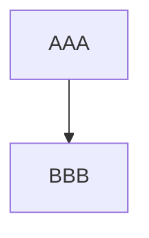

<div class="glow-text">
# Title

Test:
+ Lists, including:
  1. ordered
  1. unordered
+ **bold** and _italic_ text.
+ `inline code`

    indented code
    blocks.

```clojure
;; fenced code blocks w/ syntax highlighting.
(defn make-rot-n [n alphabet]
  (->> alphabet
    cycle
    (drop n)
    (zipmap alphabet)))

(def rot-13 (make-rot-n 13 "abcdefghijklmnopqrstuvwxyz"))
```

[Links!](www.duckduckgo.com)


[Below](#gh)

----

### gh
Some gh/mdbook only features (shouldn't work)



|tableS|a|b|
|--------:|-|-|
|1|2|3|

```admonish
admonishments!
```

katex:
$$ 1 \cdot 2 = 2 $$
</div>

